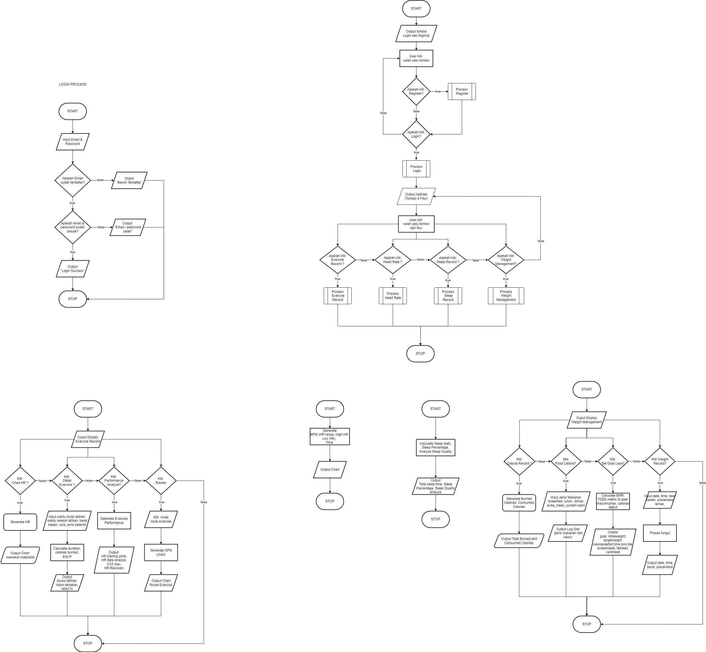

# Huawei Health APP
The Huawei Health application is a platform developed using the functional paradigm in the Python programming language. With a functional approach, this application enables users to comprehensively record, analyze, and monitor various aspects of health.

## Features
1. Exercise Recording
2. Heart Rate Monitoring
3. Sleep Pattern Recording
4. Weight Management

## Flowchart

## Members
- 202110370311462 - [Bahrul Ulum Fadhlur Rohman](https://github.com/ulumfr)
- 202110370311481 - [Muhammad Gus Nadir](https://github.com/mgusnadir)